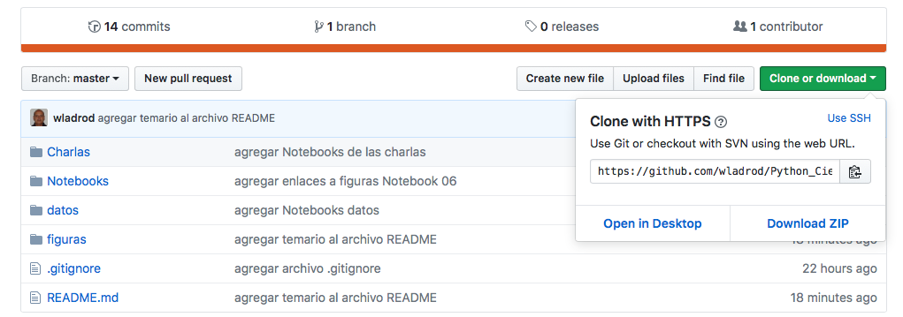
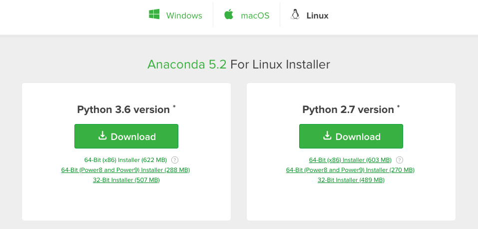
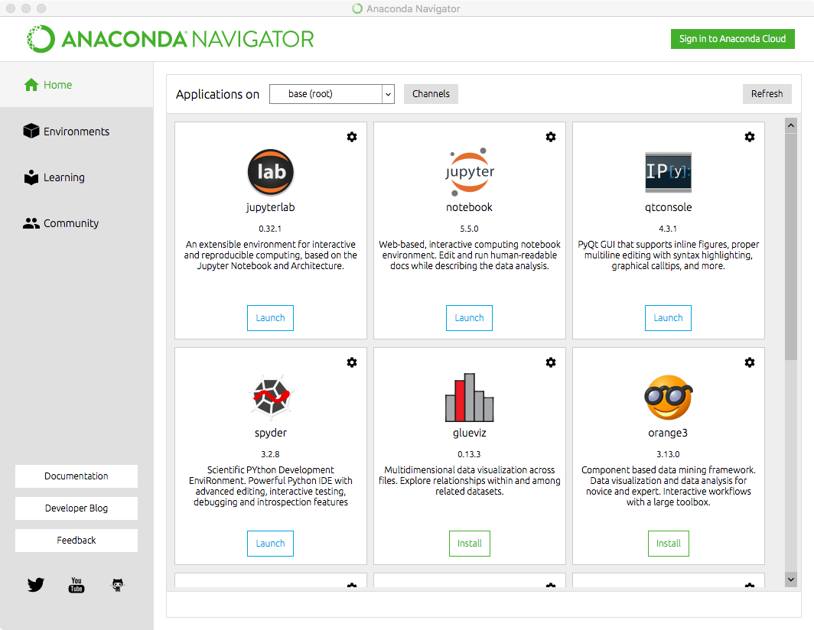

# Curso de Herramientas de Python para la Ciencias de Datos y el Aprendizaje Automático

Este repositorio contiene el material de las charlas sobre _Aprendizaje Automático_ y _Aprendizaje Profundo_, así como del curso sobre _Herrmmientas Python para la Ciencias de Datos y Aprendizaje Automáticos_ dictados en la Universidad de Pamplona (Colombia), del 5 de Junio al 8 de Junio del 2018.

**Charlas:**
1. [Introducción al Aprendizaje Automático](https://github.com/wladrod/Python_Ciencias_Datos/blob/master/Charlas/CharlaAprendizajeAutomatico.ipynb)
2. [Introducción al Aprendizaje Profundo](https://github.com/wladrod/Python_Ciencias_Datos/blob/master/Charlas/CharlaAprendizajeProfundo.ipynb)

**Curso Herramientas Python para la Ciencias de Datos y el Aprendizaje Automático:**
1. [Introducción a Jupyter Notebooks y Jupyter Lab](https://github.com/wladrod/Python_Ciencias_Datos/blob/master/Notebooks/01-TutorialJupyterLab.ipynb)
2. [Introducción a Python](https://github.com/wladrod/Python_Ciencias_Datos/blob/master/Notebooks/02-TutorialPython.ipynb)
3. [Introducción a Numpy](https://github.com/wladrod/Python_Ciencias_Datos/blob/master/Notebooks/03-TutorialNumpy.ipynb)
4. [Introducción a Matplotlib](https://github.com/wladrod/Python_Ciencias_Datos/blob/master/Notebooks/04-TutorialMatplotlib.ipynb)
5. [Introducción a Pandas](https://github.com/wladrod/Python_Ciencias_Datos/blob/master/Notebooks/05-TutorialPandas.ipynb)
6. [Introducción a Scikit-learn](https://github.com/wladrod/Python_Ciencias_Datos/blob/master/Notebooks/06-TutorialSklearn.ipynb)

## Descargar el Material

Si desea codificar durante el curso, siga estos pasos.

Si está familiarizado con `git`, puedes clonar este repositorio. Para hacerlo en la línea de comando, escriba

```bash
git clone git@github.com:wladrod/Python_Ciencias_Datos.git
```
Si no está familiarizado con git, puede descargar el código directamente desde GitHub.



## Instalar Anaconda

*Si no tiene instalado conda o anaconda*, es posible que desee descargar la distribución de Python Anaconda. Vaya a [anaconda.org](https://anaconda.org) y haga clic en Download Anaconda.


Seleccione la versión de Python 3.X para su sistema operativo (se debe elegir automáticamente). Descargue e instale anaconda.



Asegúrate de que puedes ejecutar los Jupyter Notebooks, desde la linea de comando escriba

```bash
jupyter notebook
```

También puede utilizar la aplicación `Anaconda Navigator`:




